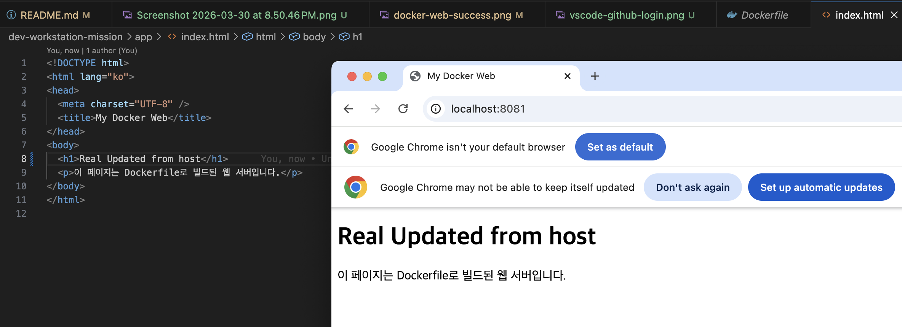

# 개발 워크스테이션 구축 미션

## 1. 프로젝트 개요

터미널, Docker, Git/GitHub를 사용해 재현 가능한 개발 워크스테이션을 구축하고, 수행 과정과 검증 결과를 README에 기록한다.

---

## 2. 실행 환경

- OS: macOS (Darwin Kernel Version 24.6.0)
- Shell: `/bin/zsh`
- 터미널: [직접 입력: Terminal / iTerm2 등]
- Docker 엔진 실행 환경: OrbStack
- Docker 버전: Docker version 28.5.2
- Git 버전: git version 2.53.0

---

## 3. 수행 체크리스트

- [x] 프로젝트 개요가 있다
- [x] 실행 환경(OS/쉘/터미널/Docker/Git)이 있다
- [x] 터미널 조작 로그가 있다
- [x] 파일 권한 실습 전/후가 있다
- [x] docker --version, docker info 결과가 있다
- [x] docker images / ps / ps -a / logs / stats 결과가 있다
- [x] hello-world 실행 증거가 있다
- [x] ubuntu 컨테이너 진입 증거가 있다
- [x] Dockerfile, app 소스가 저장소에 있다
- [x] 커스텀 이미지 빌드/실행 로그가 있다
- [x] 포트 매핑 접속 증거가 있다
- [x] bind mount 전/후 비교가 있다
- [x] volume 영속성 검증이 있다
- [x] git config --list 결과가 있다
- [x] GitHub / VSCode 연동 증거가 있다
- [x] 트러블슈팅 2건 이상 있다
- [x] 민감정보가 가려져 있다

---

## 4. 터미널 조작 로그

### 4-1. 현재 위치 및 파일 목록 확인

```zsh
$ pwd
/Users/shh921shh4393/dev
```

```zsh
$ ls -la
total 0
drwxr-xr-x   4 shh921shh4393  shh921shh4393  128 Mar 30 18:04 .
drwxr-x---+ 21 shh921shh4393  shh921shh4393  672 Mar 30 18:04 ..
```

### 4-2. 파일/디렉토리 생성, 복사, 이동, 삭제, 내용 확인

```zsh
$ mkdir -p practice/dir1
$ cd practice
$ touch empty.txt
$ echo "hello workstation" > note.txt
$ cat note.txt
hello workstation
$ cp note.txt note-copy.txt
$ mv note-copy.txt renamed.txt
$ mkdir archive
$ mv renamed.txt archive
$ ls -la
total 8
drwxr-xr-x  6 shh921shh4393  shh921shh4393  192 Mar 30 18:26 .
drwxr-xr-x  5 shh921shh4393  shh921shh4393  160 Mar 30 18:25 ..
drwxr-xr-x  3 shh921shh4393  shh921shh4393   96 Mar 30 18:26 archive
drwxr-xr-x  2 shh921shh4393  shh921shh4393   64 Mar 30 18:25 dir1
-rw-r--r--  1 shh921shh4393  shh921shh4393    0 Mar 30 18:25 empty.txt
-rw-r--r--  1 shh921shh4393  shh921shh4393   18 Mar 30 18:25 note.txt
$ rm empty.txt
```

터미널에서 현재 위치 확인, 숨김 파일 포함 목록 확인, 디렉토리 생성, 파일 생성, 내용 작성, 복사, 이름 변경, 이동, 삭제를 수행했다.

---

## 5. 파일 권한 실습

### 5-1. 권한 변경 전/후 비교

```zsh
# 권한 변경 전
$ ls -ld permission-file.txt permission-dir
d---------  2 shh921shh4393  shh921shh4393  64 Mar 30 18:32 permission-dir
----------  1 shh921shh4393  shh921shh4393   0 Mar 30 18:31 permission-file.txt

$ chmod 644 permission-file.txt
$ chmod 755 permission-dir

# 권한 변경 후
$ ls -ld permission-file.txt permission-dir
drwxr-xr-x  2 shh921shh4393  shh921shh4393  64 Mar 30 18:32 permission-dir
-rw-r--r--  1 shh921shh4393  shh921shh4393   0 Mar 30 18:31 permission-file.txt
```

### 5-2. 권한 설명

- `r` = read
- `w` = write
- `x` = execute
- `644` = 소유자 `rw-`, 그룹 `r--`, 기타 사용자 `r--`
- `755` = 소유자 `rwx`, 그룹 `r-x`, 기타 사용자 `r-x`

### 5-3. 경로 설명

- 절대 경로: `/Users/username/dev-workstation-mission/app/index.html`
- 상대 경로: `./app/index.html`

---

## 6. Docker 설치 및 점검

```zsh
$ docker --version
Docker version 28.5.2, build ecc6942

$ docker info

Client:
 Version:    28.5.2
 Context:    orbstack
 Debug Mode: false
 Plugins:
  buildx: Docker Buildx (Docker Inc.)
    Version:  v0.29.1
    Path:     /Users/shh921shh4393/.docker/cli-plugins/docker-buildx
  compose: Docker Compose (Docker Inc.)
    Version:  v2.40.3
    Path:     /Users/shh921shh4393/.docker/cli-plugins/docker-compose

Server:
 Containers: 11
  Running: 5
  Paused: 0
  Stopped: 6
 Images: 4
 Server Version: 28.5.2
 Storage Driver: overlay2
  Backing Filesystem: btrfs
  Supports d_type: true
  Using metacopy: false
  Native Overlay Diff: true
  userxattr: false
 Logging Driver: json-file
 Cgroup Driver: cgroupfs
 Cgroup Version: 2
 Plugins:
  Volume: local
  Network: bridge host ipvlan macvlan null overlay
  Log: awslogs fluentd gcplogs gelf journald json-file local splunk syslog
 CDI spec directories:
  /etc/cdi
  /var/run/cdi
 Swarm: inactive
 Runtimes: io.containerd.runc.v2 runc
 Default Runtime: runc
 Init Binary: docker-init
 containerd version: 1c4457e00facac03ce1d75f7b6777a7a851e5c41
 runc version: d842d7719497cc3b774fd71620278ac9e17710e0
 init version: de40ad0
 Security Options:
  seccomp
   Profile: builtin
  cgroupns
 Kernel Version: 6.17.8-orbstack-00308-g8f9c941121b1
 Operating System: OrbStack
 OSType: linux
 Architecture: x86_64
 CPUs: 6
 Total Memory: 15.67GiB
 Name: orbstack
 ID: 24cb8908-86a3-4b7a-b84f-7bfcc9f4c900
 Docker Root Dir: /var/lib/docker
 Debug Mode: false
 Experimental: false
 Insecure Registries:
  ::1/128
  127.0.0.0/8
 Live Restore Enabled: false
 Product License: Community Engine
 Default Address Pools:
   Base: 192.168.97.0/24, Size: 24
   Base: 192.168.107.0/24, Size: 24
   Base: 192.168.117.0/24, Size: 24
   Base: 192.168.147.0/24, Size: 24
   Base: 192.168.148.0/24, Size: 24
   Base: 192.168.155.0/24, Size: 24
   Base: 192.168.156.0/24, Size: 24
   Base: 192.168.158.0/24, Size: 24
   Base: 192.168.163.0/24, Size: 24
   Base: 192.168.164.0/24, Size: 24
   Base: 192.168.165.0/24, Size: 24
   Base: 192.168.166.0/24, Size: 24
   Base: 192.168.167.0/24, Size: 24
   Base: 192.168.171.0/24, Size: 24
   Base: 192.168.172.0/24, Size: 24
   Base: 192.168.181.0/24, Size: 24
   Base: 192.168.183.0/24, Size: 24
   Base: 192.168.186.0/24, Size: 24
   Base: 192.168.207.0/24, Size: 24
   Base: 192.168.214.0/24, Size: 24
   Base: 192.168.215.0/24, Size: 24
   Base: 192.168.216.0/24, Size: 24
   Base: 192.168.223.0/24, Size: 24
   Base: 192.168.227.0/24, Size: 24
   Base: 192.168.228.0/24, Size: 24
   Base: 192.168.229.0/24, Size: 24
   Base: 192.168.237.0/24, Size: 24
   Base: 192.168.239.0/24, Size: 24
   Base: 192.168.242.0/24, Size: 24
   Base: 192.168.247.0/24, Size: 24
   Base: fd07:b51a:cc66:d000::/56, Size: 64

WARNING: DOCKER_INSECURE_NO_IPTABLES_RAW is set
```

- `docker --version`: Docker CLI 설치 여부 확인
- `docker info`: Docker daemon 및 엔진 동작 여부 확인

---

## 7. Docker 기본 운영 명령 및 컨테이너 실습

### 7-1. `hello-world` 실행

```zsh
$ docker run hello-world
Unable to find image 'hello-world:latest' locally
latest: Pulling from library/hello-world
4f55086f7dd0: Pull complete
Digest: sha256:452a468a4bf985040037cb6d5392410206e47db9bf5b7278d281f94d1c2d0931
Status: Downloaded newer image for hello-world:latest

Hello from Docker!
This message shows that your installation appears to be working correctly.

To generate this message, Docker took the following steps:
 1. The Docker client contacted the Docker daemon.
 2. The Docker daemon pulled the "hello-world" image from the Docker Hub.
    (amd64)
 3. The Docker daemon created a new container from that image which runs the
    executable that produces the output you are currently reading.
 4. The Docker daemon streamed that output to the Docker client, which sent it
    to your terminal.
```

`hello-world` 실행 결과를 통해 Docker가 이미지를 pull하고 컨테이너를 생성 및 실행할 수 있음을 확인했다.

### 7-2. 이미지 및 컨테이너 목록 확인

```zsh
$ docker images
REPOSITORY    TAG       IMAGE ID       CREATED          SIZE
my-web        1.0       bf77efb0c126   56 minutes ago   62.2MB
nginx         alpine    d5030d429039   5 days ago       62.2MB
hello-world   latest    e2ac70e7319a   6 days ago       10.1kB
ubuntu        latest    f794f40ddfff   4 weeks ago      78.1MB

$ docker ps
CONTAINER ID   IMAGE     COMMAND   CREATED   STATUS    PORTS     NAMES
```

```zsh
$ docker ps -a
CONTAINER ID   IMAGE         COMMAND    CREATED              STATUS                          PORTS     NAMES
80bea571fafc   hello-world   "/hello"   About a minute ago   Exited (0) About a minute ago             quizzical_jang
```

`docker ps`에서는 실행 중인 컨테이너만 보이고, `docker ps -a`에서는 종료된 컨테이너까지 확인할 수 있다.

### 7-3. 로그 확인

```zsh
docker logs ubuntu-test
root@cfec90c65426:/# ls
bin   dev  home  lib64  mnt  proc  run   srv  tmp  var
boot  etc  lib   media  opt  root  sbin  sys  usr
root@cfec90c65426:/# echo "inside container"
inside container
root@cfec90c65426:/# exit
exit

```

### 7-4. Ubuntu 컨테이너 진입

```zsh
$ docker run -it --name ubuntu-test ubuntu bash
root@cfec90c65426:/# ls
bin   dev  home  lib64  mnt  proc  run   srv  tmp  var
boot  etc  lib   media  opt  root  sbin  sys  usr
root@cfec90c65426:/# echo "inside container"
inside container
root@cfec90c65426:/# exit
exit
```

Ubuntu 컨테이너 내부에 진입하여 `ls`, `echo` 명령을 수행하고 `exit`로 종료했다.

### 7-5. `attach` / `exec` 차이 관찰

- `attach`: 기존 메인 프로세스에 연결
- `exec`: 실행 중인 컨테이너 안에서 새 명령 실행

```zsh
$ docker run -dit --name ubuntu-bg ubuntu bash
$ docker exec -it ubuntu-bg bash
```

### 7-6. 리소스 사용량 확인

```zsh
$ docker stats --no-stream
CONTAINER ID   NAME              CPU %     MEM USAGE / LIMIT     MEM %     NET I/O         BLOCK I/O    PIDS
5d8ab63a14b6   optimistic_benz   0.00%     1.312MiB / 15.67GiB   0.01%     1.13kB / 126B   147kB / 0B   1
```

---

## 8. Dockerfile 기반 커스텀 이미지 제작

### 8-1. 베이스 이미지

- `nginx:alpine`

### 8-2. Dockerfile

```dockerfile
FROM nginx:alpine

LABEL org.opencontainers.image.title="my-custom-nginx"
ENV APP_ENV=dev

COPY app/ /usr/share/nginx/html/
```

### 8-3. `app/index.html`

```html
<!DOCTYPE html>
<html lang="ko">
<head>
  <meta charset="UTF-8" />
  <title>My Docker Web</title>
</head>
<body>
  <h1>Hello from custom Docker image</h1>
  <p>이 페이지는 Dockerfile로 빌드된 웹 서버입니다.</p>
</body>
</html>
```

### 8-4. 빌드 및 실행

```zsh
$ docker build -t my-web:1.0 .
[+] Building 0.9s (7/7) FINISHED                                                                                                                                                   docker:orbstack
 => [internal] load build definition from Dockerfile                                                                                                                                          0.1s
 => => transferring dockerfile: 161B                                                                                                                                                          0.0s
 => [internal] load metadata for docker.io/library/nginx:alpine                                                                                                                               0.0s
 => [internal] load .dockerignore                                                                                                                                                             0.1s
 => => transferring context: 2B                                                                                                                                                               0.0s
 => [internal] load build context                                                                                                                                                             0.1s
 => => transferring context: 299B                                                                                                                                                             0.0s
 => CACHED [1/2] FROM docker.io/library/nginx:alpine                                                                                                                                          0.0s
 => [2/2] COPY app/ /usr/share/nginx/html/                                                                                                                                                    0.2s
 => exporting to image                                                                                                                                                                        0.2s
 => => exporting layers                                                                                                                                                                       0.1s
 => => writing image sha256:49d94329c75b5a741a60f8b877bd4367cb6b505c20b54ee8337da76f953e8cb6                                                                                                  0.0s
 => => naming to docker.io/library/my-web:1.0  

$ docker run -d --name my-web -p 8080:80 my-web:1.0
e43a3960e0a3f5aa737a97e1bb2171f9dd5b8c9a8fb2e5e1d2862aaa6255c4ba
```

### 8-5. 확인

```zsh
$ docker ps
[직접 붙여넣기]

$ docker logs my-web
[직접 붙여넣기]

$ curl http://localhost:8080
<!DOCTYPE html>
<html lang="ko">
<head>
  <meta charset="UTF-8" />
  <title>My Docker Web</title>
</head>
<body>
  <h1>Hello from custom Docker image</h1>
  <p>이 페이지는 Dockerfile로 빌드된 웹 서버입니다.</p>
</body>
</html>
```


---

## 9. 포트 매핑 검증

```zsh
$ docker run -d --name my-web-8080 -p 8080:80 my-web:1.0
[직접 붙여넣기]
```

- `-p 8080:80` = 호스트 `8080` 포트를 컨테이너 `80` 포트에 연결
- 브라우저에서 `localhost:8080`으로 접속 가능

---

## 10. 바인드 마운트 검증

```zsh
$ docker run -d --name bind-web -p 8081:80 \
  -v $(pwd)/app:/usr/share/nginx/html \
  nginx:alpine
Unable to find image 'nginx:alpine' locally
alpine: Pulling from library/nginx
589002ba0eae: Already exists
8892f80f46a0: Already exists
91d1c9c22f2c: Already exists
cf1159c696ee: Already exists
3f4ad4352d4f: Already exists
c2bd5ab17727: Already exists
4d9d41f3822d: Already exists
3370263bc02a: Already exists
Digest: sha256:e7257f1ef28ba17cf7c248cb8ccf6f0c6e0228ab9c315c152f9c203cd34cf6d1
Status: Downloaded newer image for nginx:alpine
48a5a7ae7ddeb9df2e4b78998c35579ccd7986e1617ec9d3ff9800c5b5aa9cf7
```

- 변경 전: `Hello from custom Docker image`
- 변경 후: `Updated from host`




바인드 마운트를 사용하면 호스트의 `app` 디렉토리 변경 사항이 컨테이너 웹 루트에 즉시 반영된다.

---

## 11. Docker 볼륨 영속성 검증

```zsh
$ docker volume create mydata
mydata

$ docker volume ls
DRIVER    VOLUME NAME
local     mydata

$ docker run -d --name vol-test -v mydata:/data ubuntu sleep infinity
4029dc11552b7df0f9b1a28f2926079251b7a03368e0f9cfac1006f176243e12

$ docker exec -it vol-test bash -lc "echo hi > /data/hello.txt && cat /data/hello.txt"
hi

$ docker rm -f vol-test
vol-test

$ docker run -d --name vol-test2 -v mydata:/data ubuntu sleep infinity
339fd6efef405995e68c8f002d7e34acf849944b52ccbfd8ac1bc0b39e91482f

$ docker exec -it vol-test2 bash -lc "cat /data/hello.txt"
hi
```

동일한 볼륨을 새 컨테이너에 다시 연결했을 때 `hello.txt`가 유지되어 데이터 영속성을 확인했다.

---

## 12. Git 설정 및 GitHub / VSCode 연동

### 12-1. Git 설정

```zsh
$ git config --global user.name "shannonlee-dev"
$ git config --global user.email "shannon.lee.dev@*****.com"
$ git config --global init.defaultBranch main
$ git config --list
credential.helper=osxkeychain
user.name=shannonlee-dev
user.email=shannon.lee.dev@*****.com
init.defaultbranch=main
core.repositoryformatversion=0
core.filemode=true
core.bare=false
core.logallrefupdates=true
core.ignorecase=true
core.precomposeunicode=true
```

### 12-2. 저장소 초기화 및 push

```zsh
$ git init
$ git add .
$ git commit -m "Initialize dev workstation mission"
$ git remote add origin [직접 입력: GitHub 저장소 URL]
$ git push -u origin main
```

### 12-3. VSCode / GitHub 연동


---

## 13. 검증 방법 및 결과 위치

| 항목 | 검증 방법 | 결과 위치 |
|---|---|---|
| 터미널 조작 | `pwd`, `ls -la`, `mkdir`, `touch`, `cp`, `mv`, `rm`, `cat` | 4장 |
| 파일 권한 | `ls -ld`, `chmod` | 5장 |
| Docker 설치/점검 | `docker --version`, `docker info` | 6장 |
| 컨테이너 기본 실행 | `docker run hello-world` | 7장 |
| Ubuntu 진입 | `docker run -it ubuntu bash` | 7장 |
| Docker 운영 명령 | `docker images`, `docker ps`, `docker ps -a`, `docker logs`, `docker stats` | 7장 |
| 커스텀 이미지 | `docker build`, `docker run`, `curl` | 8장 |
| 포트 매핑 | `-p 8080:80` + 브라우저 접속 | 9장 |
| 바인드 마운트 | `-v $(pwd)/app:/usr/share/nginx/html` | 10장 |
| 볼륨 영속성 | `docker volume create`, `docker exec`, 컨테이너 재생성 | 11장 |
| Git 설정 | `git config --list` | 12장 |
| GitHub/VSCode 연동 | 연동 화면 스크린샷 | 12장 |

---

## 14. 트러블슈팅

### 문제 1. `docker info` 실행 실패

- 문제: `Cannot connect to the Docker daemon`
- 원인 가설: Docker 엔진이 실행되지 않음
- 확인: OrbStack 앱이 꺼져 있었음
- 해결: OrbStack 실행 후 `docker info` 재시도

### 문제 2. 브라우저 접속 실패

- 문제: `localhost:8080` 접속 불가
- 원인 가설: 포트 매핑 누락 또는 잘못된 포트 지정
- 확인: `docker ps`에서 `PORTS` 항목 확인
- 해결: `-p 8080:80`으로 다시 실행

### 문제 3. Ubuntu 컨테이너 `zsh` 진입 실패

- 문제: `docker run -it ubuntu zsh` 동작 불가
- 원인 가설: 기본 `ubuntu` 이미지에 `zsh` 미설치
- 확인: `bash`로는 정상 진입 가능
- 해결: 실습을 `bash` 기준으로 통일

---

## 15. 제출 전 확인

- [ ] `docker --version`, `docker info` 실제 출력 추가
- [ ] `docker images`, `docker ps`, `docker ps -a`, `docker logs`, `docker stats` 실제 출력 보강
- [ ] `docker build`, `docker run`, `docker logs my-web` 실제 출력 추가
- [ ] GitHub 저장소 URL 입력
- [ ] VSCode GitHub 연동 스크린샷 첨부
- [ ] 이메일 / 토큰 / 민감정보 마스킹 확인
- [ ] README 코드블록 깨짐 여부 확인